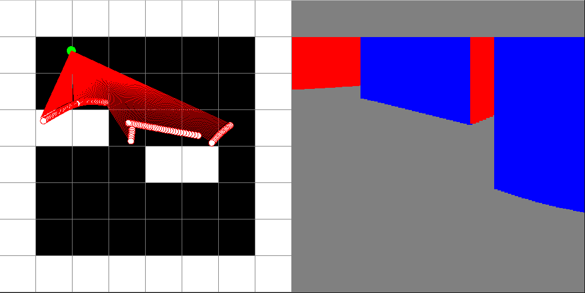
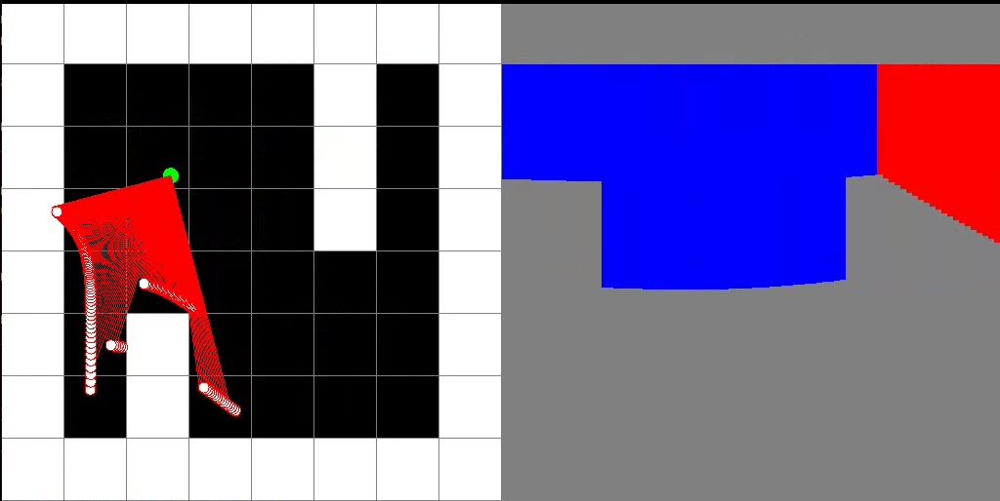

# SFML Raycaster in C++

This project showcases a raycaster implemented in C++ using SFML and the DDA (Digital Differential Analyzer) algorithm.

## Preview



[](trimmed.mp4)


## Build and Run

To build and run the project, follow these steps:

1. **Install Dependencies**: Ensure you have SFML installed on your system.

2. **Build the Project**:
    ```bash
    make
    ```

3. **Run the Application**:
    ```bash
    ./raycaster
    ```

## Description

The project demonstrates a raycasting technique using SFML. The video shows the raycaster in action.


